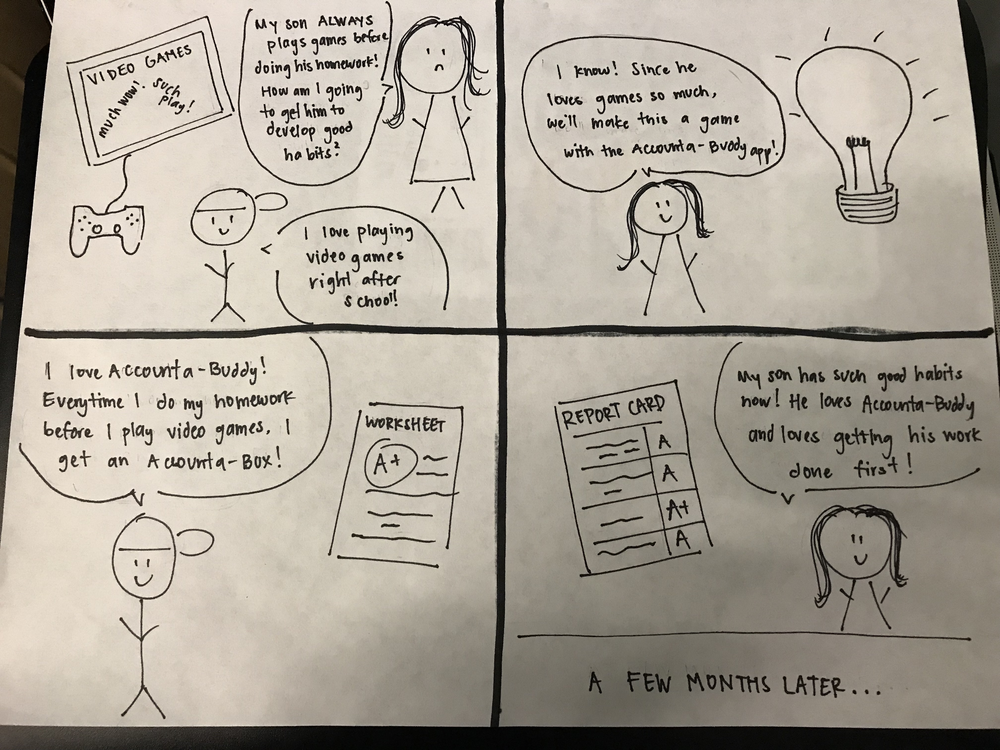

# Team: Accounta-Buddy
## Team Members
- Christopher Guan
- Steven Phung
- Jerry Shu
- Nathan Werrede

## Project Proposal
It is much easier to develop healthy habits when there is a way to maintain accountability. Nobody holds you more accountable than the people in your life. Our app Accounta-Buddy gamifies partner accountability using monetary incentives :money_with_wings:. Imagine you are 35 & have your habits set in stone, but you want to make a change. Maybe you want to go to the gym, learn a new language, or learn an instrument. If you were a parent, you might want to fix your child’s sleep schedule, get them to do their homework, and practice the piano. What if managing that wasn’t a chore but a fun game?

Our application helps keep you and your Accounta-Buddy accountable. After creating an agreement with someone, you can set up the parameters such as:
- what task each person needs to fulfill,
- the time they need to fulfill it by
- the amount of money that will be exchanged for not fulfilling the task

Users would put in a set amount of money into their account to be able to play the duration of the game/agreement. When a user successfully completes a task, they would send evidence in the form of a text description, picture, or video, ready for their Accounta-Buddy to review & confirm. If the user could not fulfill the task, the app will notify them to pay their Accounta-Buddy. If the user does not pay, the app will remind the user to pay up and a notification will be sent to their Accounta-Buddy where they can remind the user

## Target Audience
Our target audience is older people (middle-aged specifically) trying to re-spark their lives by developing new habits or hobbies for themselves or the people who are close to them. As described by our example use cases/users below, we really want to focus on the middle-aged demographic:

1. Two middle-aged men decide to go to the gym like they used to in college. When one misses a day, that person pays out an agreed upon amount of Accounta-Bux to the other. If both people fulfill the agreement, or neither fulfills the agreement, then nobody has a net gain.
2.  A parent is trying to encourage their 10 year old to do their homework right after school. When the child completes their homework before 6pm, they sent a verification message with evidence (such as a picture) to their parent, and the parent confirms on the app, which transfers Accounta-Bux to the child.

We are not part of that user population because we aren’t middle-aged, have kids, or need to make significant lifestyle changes. At this point, as college students, we are still discovering who we are, what our interests are, and don’t usually have dependents. Thus, we are not at the point of trying to re-spark our lives.

## Possible Real-World Data and/or APIs
Since our application will send money peer-to-peer, we might possibly use payment APIs from:
- Square
- PayPal
- Facebook PayPal

Since our application would require setting up accounts, storing information, maintaining media (photos, etc.), we will highly use Google's Firebase and the APIs they provide with:
- [Authentication](https://firebase.google.com/products/auth/)
- [Firestore](https://firebase.google.com/products/firestore/)
- [Cloud Storage](https://firebase.google.com/products/storage/)

## Storyboard 1

This storyboard highlights the first example we gave under the Target Audience section. Here, we have the setting of two adults trying to get back into the habit of working out again. The two friends use the app to be able to make this fun and to keep each other accountable.

## Storyboard 2

This storyboard highlights the second example we gave under the Target Audience section. Here, we have the setting of regular household, a mother, and her son. The mother is trying to help son develop good habits.

## Prototype 1

## Prototype 2
