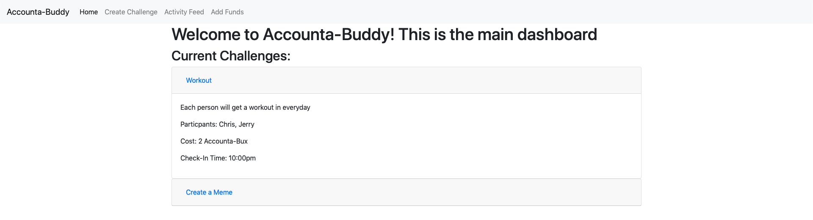
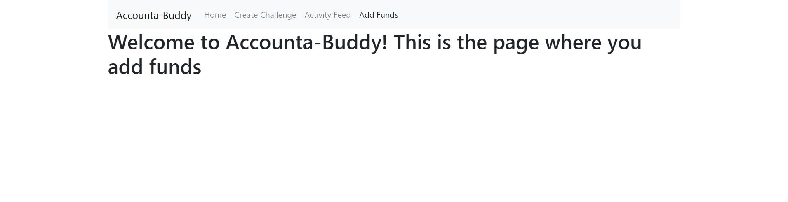
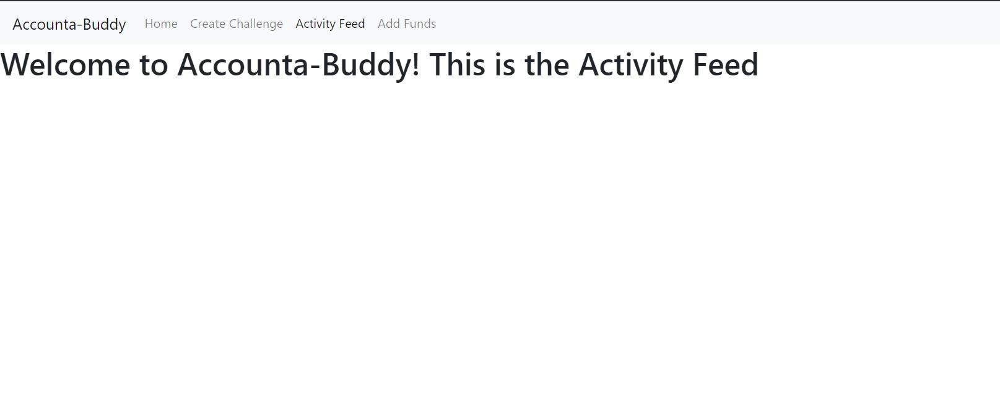

# Team: Accounta-Buddy
## Team Members
- Christopher Guan
- Steven Phung
- Jerry Shu
- Nathan Werrede

## Our Idea
We are going with our original idea, Accounta-Buddy, a web application that helps middle-aged people build habits using monetary incentives and challenges with their buddies. We are not making any changes to our idea since we got good feedback from our TA on Milestone 1.

Our application helps keep you and your Accounta-Buddy accountable. After creating an agreement with someone, you can set up the parameters such as:
- what task each person needs to fulfill,
- the time they need to fulfill it by
- the amount of money that will be exchanged for not fulfilling the task

Users would put in a set amount of money into their account to be able to play the duration of the game/agreement. When a user successfully completes a task, they would send evidence in the form of a text description, picture, or video, ready for their Accounta-Buddy to review & confirm. If the user could not fulfill the task, the app will notify them to pay their Accounta-Buddy. If the user does not pay, the app will remind the user to pay up and a notification will be sent to their Accounta-Buddy where they can remind the user

## ScreenShot 1: Home Screen
Our home screen or dash has a Nav bar, which will be on all pages, that allows the user to navigate to Home, create a new challenge, add funds, etc. For the main user interface elements, we have clickable titles that display the name of the Challenge and, when clicked, it expands to reveal more details of the challenge. This is a similar to our UI from our second paper prototype in terms of layout and Design.  

## ScreenShot 2: Create New Challenge
Our Create a Challenge page allows the user to type in the relevant information such as the challenge name, challenge duration, and selecting their Accounta-Buddy. This is pretty much exactly the same as the layout of the UI from our first paper prototype with the same information.

## ScreenShots of the rest of the skeleton
The rest of the pages are very barebones and are not finalized, however we are going with the structure of prototype 1 but using many of the UI elements of prototype 2. Included are screenshots of the login page and temporary pages for the funds & activity feed pages.

