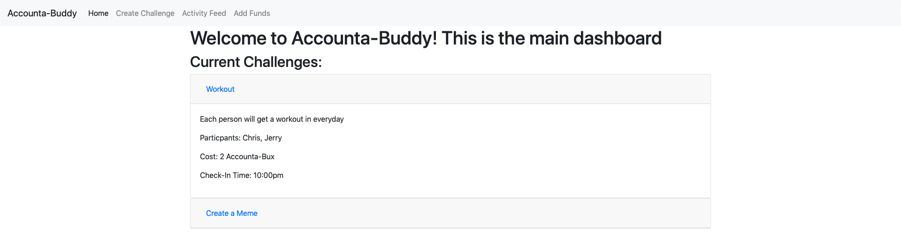
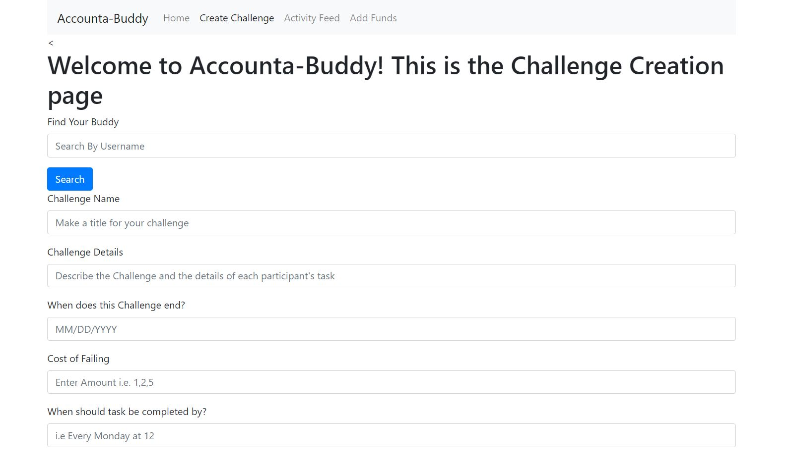
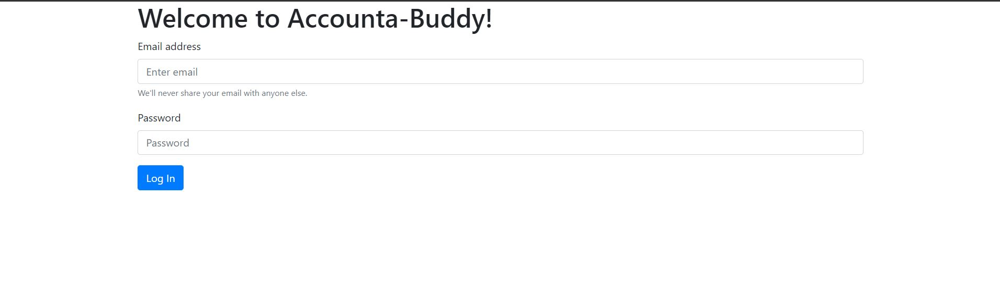

# Team: Accounta-Buddy
## Team Members
- Christopher Guan
- Steven Phung
- Jerry Shu
- Nathan Werrede

## ScreenShot 1: Home
Our homescreen or dash has many new UI changes. In milestone 2 we only had a display of the challenges that spanned the full page which made it hard to read. We now have a grid system that splits the screen in two showing the user their challenges and the details of them on the left while the right has an activity feed that displays actions that are relevant to the user such as reminders, tasks, and updates on their accounta-buddy that are colored based on how relevant they are. 
### Milestone 3

### Milestone 2

## ScreenShot 2: Create New Challenge
For milestone 2 our New Challenge page did not accurately ask for all of the information we needed from users. For milestone 3 we enlarged the text box for the description of the challenge prompting users to write more. We added a selector for users to choose if the task would be completed daily or weekly and added radio buttons for them to choose which days the events would repeat on. Finally we improved the Nav bar by moving the tabs to the right side of the screen and added dropdown functionality. 
### Milestone 3

### Milestone 2

## ScreenShot 3: Log-In
In milestone 2 we used input text boxes to prompt a login that had no functionality. In milestone 3 we are using Firebase's log-in API that actually allows users to create accounts or sign in. If users arent signed in they aren't able to access the web-app.
### Milestone 3

### Milestone 2

