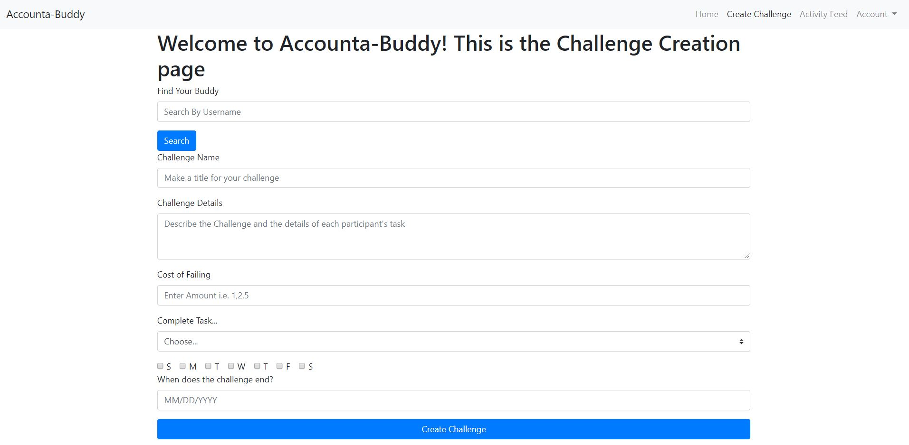

# Team: Accounta-Buddy
## Team Members
- Christopher Guan
- Steven Phung
- Jerry Shu
- Nathan Werrede

## ScreenShot 1: Home
In milestone 3 We implemented a grid system that splits the screen in two showing the user their challenges and the details of them on the left while the right has an activity feed that displays actions that are relevant to the user. In milestone 4 we color coded the challenges to show urgency that thye need to usbmit thier evidence soon. In addition we added a remind accounta-buddy button in the drop down of the challenge that supposed will send a notification to the other participant that they should pay up. 
### Milestone 4

### Milestone 3

## ScreenShot 2: Details Page
For milestone 3 our Challenge Details Page was not formatted well as images expanded the history container to fit the size of the image. For milestone 4 we realized that users don't need to see the photo and map immediately and just want to know that their accounta-buddy submitted evidence so we made buttons that open up to modals displaying the photo and map. 
### Milestone 4

## Other ScreenShots: Log-In
In milestone 2 we used input text boxes to prompt a login that had no functionality. In milestone 3 we are using Firebase's log-in API that actually allows users to create accounts or sign in. If users arent signed in they aren't able to access the web-app.
### Milestone 4

## Action 1
For our first action we allow users to create a challenge with thier Accounta-Buddy by filling out the New Challenge form. After choosing who you want to do the challenge with you fill out information such as the cost of failing, when the evidence needs to be submitted by, and describing what the challenge is. Once the form is submitted the challenge will show up on the other participants dash.

## Action 2
For our second action we allow users to submit evidence of completing their task which is comprised of uploading a photo and tagging a location. After the user submits the evidence form the users accounta-buddy can see the user's evidence show up on their feed and their individual challenge history. 

