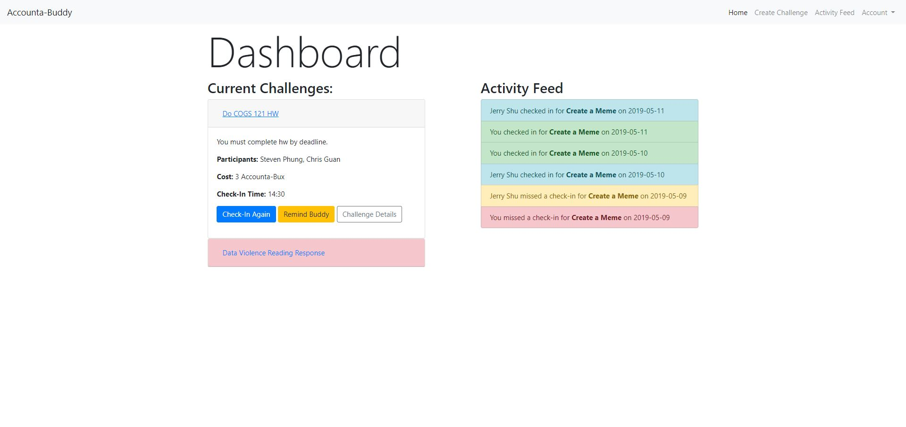
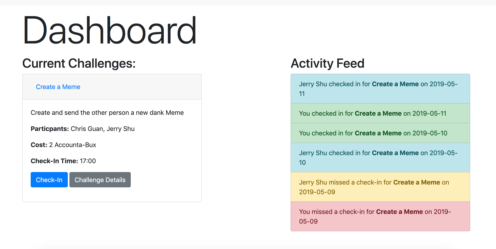
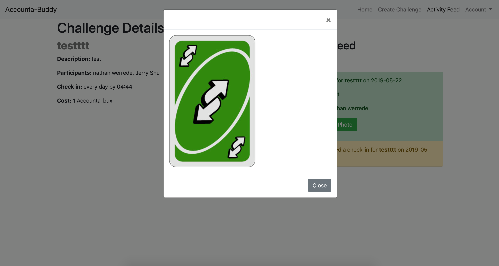
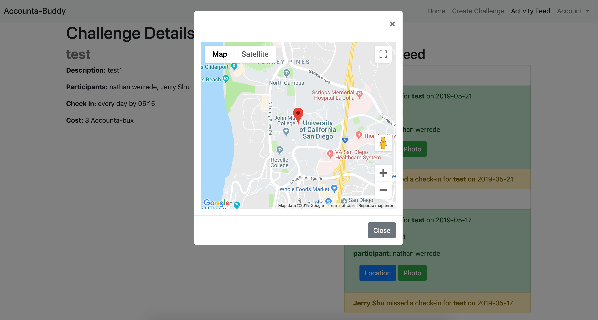
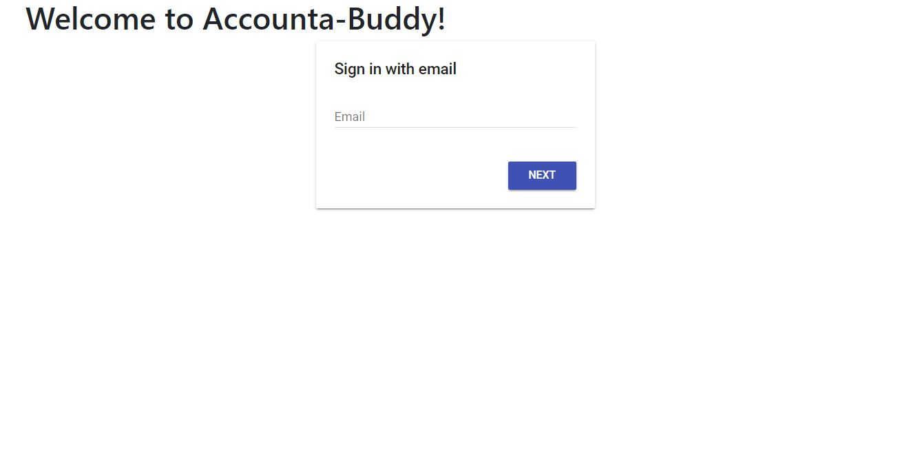
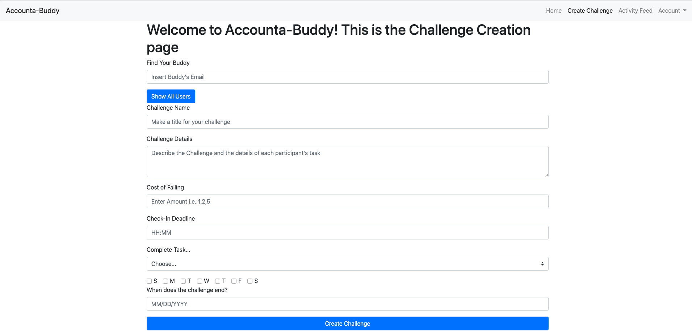

# Team: Accounta-Buddy
## Team Members
- Christopher Guan
- Steven Phung
- Jerry Shu
- Nathan Werrede

## ScreenShot 1: Home
In milestone 3, we implemented a grid system that splits the screen in two showing the user their challenges and the details of them on the left while the right has an activity feed that displays actions that are relevant to the user. In milestone 4, we color coded the challenges by making their card titles red to show urgency that they need to submit their evidence soon. In addition, we added a remind accounta-buddy button that only appears if they haven't checked in that will send a notification to the other participant to complete their challenge and check-in for the day.
### Milestone 4

### Milestone 3

## ScreenShot 2: Details Page
For milestone 3 our Challenge Details Page was not formatted well as images expanded the history container to fit the size of the image. For milestone 4, we realized that users don't need to see the photo and map immediately and just want to know that their accounta-buddy submitted evidence so we made buttons that open up to modals displaying the photo and map. Additionally, the details page just had text thrown on the screen straight from our database. It is now styled and organized in a way consistent with our dashboard with a 2-column grid, color-coded, and a cleaner presentation of information.
### Milestone 4

## Other ScreenShots: Log-In and New Challenge
For milestone 4 we focused our efforts on functionality and the Challenge Details Page so the other pages are the same as before.
### Milestone 4

## Action 1
For our first action we allow users to create a challenge with their Accounta-Buddy by filling out the New Challenge form. You can use the 'Show All Users' button to see everybody you can create a challenge with. After choosing who you want to do the challenge with, you fill out information such as your buddy's email, the cost of failing, when the evidence needs to be submitted by, and a description of what the challenge is. Once the form is submitted, the challenge will show up on both your and your buddy's dash.

## Action 2
For our second action we allow users to submit evidence of completing their task, an essential action for staying accountable. A check-in is comprised of describing what you did, uploading a photo, and tagging a location. After the user submits the evidence form, the user's accounta-buddy can see the user's evidence show up on their feed and their individual challenge history.
