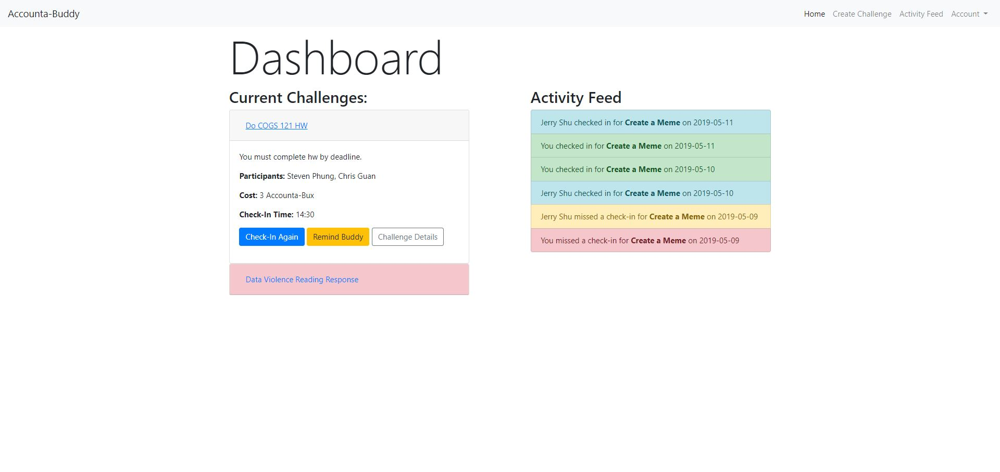

# Team: Accounta-Buddy
## Team Members
- Christopher Guan
- Steven Phung
- Jerry Shu
- Nathan Werrede

## Target User Population
To give an idea of how someone in our target user population might use our app, consider the following setting, sequence and satisfaction:

**Setting**

Someone in our target audience might be like Jenkins, a middle aged man who has been going through a midlife crisis. One of the things he did when he was younger was play sports. Hoping to help him get through the crisis, he wants to start working out regularly again. But every time he tries, he loses motivation, stops, and the midlife crisis continues.

**Sequence**

He hears about our app, Accounta-Buddy, from his friend Dale. Jenkins signs up for Accounta-Buddy and creates a challenge with Dale to work out everyday. They keep each accountable with daily check-ins made up of descriptions of what they did, a photo of them working out, and the location of them at the gym. Every single time Jenkins misses a workout and a check-in, he has to give Dale a $1!

**Satisfaction**

Over the next few months, Jenkins works out regularly now! If he ever skips a workout, it no longer stops him from working out all together. Instead, it motivates him to keep going (especially since he doesn’t want to lose money to Dale!). By keeping each other accountable, Dale and Jenkins have really built up their friendship. On top of that, Jenkins is much more happy with his life, lost weight, and put on a bunch of muscle. Thanks to the effects of Accounta-Buddy, Jenkins overcomes his midlife crisis to be satisfied with where he is in life.

## Screenshots of Our Latest UI

We made some UI changes since the last milestone. For the dashboard, we implemented a reminders section where you would be notified in when your buddy sends a reminder.
### Milestone 5

### Milestone 4

We made the checkins in the challenge description page a dropdown rather than displaying all the info at the same time, to make the feed less cluttered. Expanding the checkin would present you with the participant information, check in description, along with map and photo buttons, that were previously already shown.
### Milestone 5

### Milestone 4

For our add funds page, we have increments of 5 and 10 Accountabux, and your updated balance is shown below
### Milestone 5

## Screenshots of Data Display/Visualization
To implement the way our data display and visualizations, we took advantage of the front-end library Bootstrap so that we didn’t need to implement all the visual components ourselves from scratch. We used various provided components such as cards, carousels to be able to expand and collapse information, and their stylized lists to organize our data. We hooked it up to our database by using the provided Firebase methods from their API, querying a specific user or a specific challenge. Once the data about  arrived in our front-end, we created methods that would create HTML templates (using JavaScript template literals), similar to Handlebars, that would display the data on the front-end.
### Generated Lists from Database

Additionally, we combined this library with the Google Maps API, using Bootstrap to display the map data we got from the API. Because our app has locations associated with the challenge, we used modals from Bootstrap to display a map with the location from the Google Maps API.
### Maps Implementation

## Ambitious Data Display/Visualization
Some ambitious data display and visualization ideas we had were to have a line chart of your balance of Accounta-Bux over time. 

This could provide users of a good, high-level overview of how they are doing in their challenges. Each point in the chart would produce a tooltip that could give the user some information about which challenge they completed or missed. These insights to the user would allow them to focus on the challenges they are struggling with so that they can reduce the number of times they miss check-ins and remain accountable.

Another ambitious data display would be to visualize checkins across multiple different challenges and display it to a given user so that they could see both their own checkins, as well as their friends’ checkins. This could give users a better activity summary of their friend circle, and compare their challenge progress to their friends’ challenge progresses. Not only would this be a good visualization, it would help boost the social network (the Buddy part, if you will) aspect of the app.
